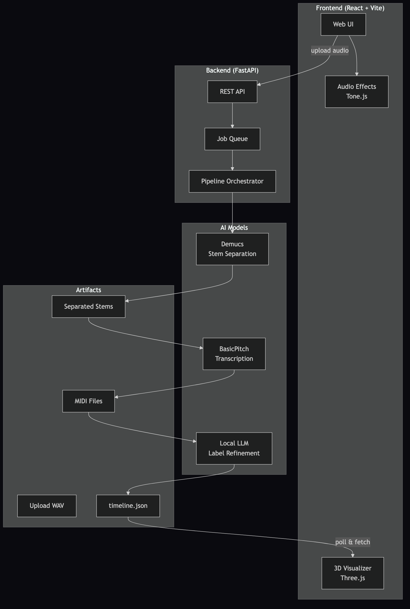

# AudiFX Architecture

What's built today, and what to build next.

# Part 1: What Exists Now

All of this is working code in the repo.

## System Overview



## Processing Pipeline

When someone uploads audio, it goes through these stages one by one:

| Stage | Tool | What Happens |
|-------|------|-------------|
| 1. Preprocessing | ffmpeg (`app/dsp/preprocess.py`) | Normalize to 44.1kHz stereo, loudness normalize, convert to WAV |
| 2. Stem Separation | Demucs htdemucs (`app/models/separation.py`) | Splits into 4 stems: vocals, bass, drums, other |
| 3. Transcription | BasicPitch (`app/models/transcribe.py`) | Converts melodic stems to MIDI notes. Drums use onset detection with spectral centroid classification |
| 4. Post Processing | `app/dsp/postprocess.py` | Remove micro notes under 80ms, merge adjacent identical notes, clamp pitch ranges, limit polyphony |
| 5. LLM Refinement | llama.cpp (`app/models/llm.py`, optional) | Rename labels like "other" to "Piano", detect song structure |
| 6. Timeline Output | `app/pipeline.py` | Write timeline.json with voices, notes, sections |

## Models in Use

| Model | Who Made It | What It Does | Where It Falls Short |
|-------|------------|-------------|---------------------|
| [Demucs](https://github.com/facebookresearch/demucs) | Meta AI Research | Stem separation | Fixed to 4 stems. The "other" bucket is a catch all |
| [BasicPitch](https://github.com/spotify/basic-pitch) | Spotify | Audio to MIDI transcription | Misses notes in dense polyphonic passages |
| librosa onset_detect | Open source | Drum hit detection | Rule based. Can only tell kick from snare from hihat |
| llama.cpp (any GGUF) | Open source | Label and structure refinement | Optional. Adds latency. Not essential |

## Backend Modules

| Module | Path | What It Does |
|--------|------|-------------|
| API Server | `app/main.py` | FastAPI routes, uploads, job management, stem and MIDI serving |
| Pipeline | `app/pipeline.py` | Runs all 6 stages, writes timeline.json |
| Worker | `app/worker.py` | Background job queue |
| Separation | `app/models/separation.py` | Demucs wrapper |
| Transcription | `app/models/transcribe.py` | BasicPitch wrapper, drum onset detection |
| LLM | `app/models/llm.py` | llama.cpp wrapper |
| Preprocess | `app/dsp/preprocess.py` | ffmpeg normalization |
| Postprocess | `app/dsp/postprocess.py` | Note cleanup |
| Analysis | `app/analysis/` | Key detection, chords, PCA, Tonnetz |
| Storage | `app/artifacts/storage.py` | File path management |
| Job State | `app/jobs/state.py` | In memory job tracking with JSON persistence |

## Frontend Modules

| Module | Path | What It Does |
|--------|------|-------------|
| Audio Effects | `src/effects/` | 7 Tone.js effect chains |
| Genre Presets | `src/presets/` | 8 presets with cultural context |
| Audio Context | `src/context/AudioContext.tsx` | Playback state, effect routing |
| MIDI Visualizer | `src/components/MIDIVisualizer/` | Three.js 3D rendering |
| Effect Panel | `src/components/EffectPanel/` | Effect selection and sliders |
| Transport | `src/components/TransportControls/` | Play, pause, seek, volume |

## What's Not Great Yet

1. BasicPitch alone misses notes in complex passages
2. Drum classification is crude, can only do kick/snare/hihat
3. No beat grid, notes aren't quantized to musical positions
4. No BPM or tempo detection
5. Frontend polls for progress instead of streaming

## Data Format

### timeline.json

```json
{
  "mix": {
    "url": "/jobs/{id}/audio",
    "duration": 210.4
  },
  "voices": [
    {
      "id": "vocals",
      "label": "Lead Vocals",
      "color": "#ff4d4d",
      "midiUrl": "/jobs/{id}/midi/vocals",
      "notes": [
        { "time": 0.5, "duration": 0.8, "pitch": 60, "velocity": 80 }
      ]
    }
  ],
  "sections": [
    { "t0": 0, "t1": 15, "name": "Intro" },
    { "t0": 15, "t1": 45, "name": "Verse" }
  ]
}
```

Each note has `time` (seconds), `duration` (seconds), `pitch` (MIDI 0 to 127), and `velocity` (loudness 0 to 127).

---

# Part 2: Upgrade Plan

What to actually build next. About 3 weeks of work. All open source, all free.

## The Tools

All open source. Links to repos, papers, and install commands below.

**[Demucs](https://github.com/facebookresearch/demucs)** (Meta). Stem separation. Top of the [MUSDB18 benchmark](https://sigsep.github.io/datasets/musdb.html). Used by [stems.fm](https://stems.fm) and [lalal.ai](https://www.lalal.ai/). `pip install demucs`. [Paper](https://arxiv.org/abs/2211.08553). [Blog](https://ai.meta.com/blog/demucs-music-source-separation/).

**[BasicPitch](https://github.com/spotify/basic-pitch)** (Spotify). Audio to MIDI. Published at ICASSP 2022. Has a [browser demo](https://basicpitch.spotify.com). `pip install basic-pitch`. [Paper](https://arxiv.org/abs/2206.11327). [Blog](https://research.atspotify.com/2022/06/basic-pitch/).

**[librosa](https://github.com/librosa/librosa)** (open source). General audio analysis. The standard Python audio library. `pip install librosa`. [Docs](https://librosa.org/doc/).

**[MT3](https://github.com/magenta/mt3)** (Google, Magenta team). Multi instrument transcription using a T5 transformer. Published at ICLR 2022. Runs on Flax/JAX, not PyTorch. If that's a problem, use Omnizart instead. [Paper](https://arxiv.org/abs/2111.03017). [Blog](https://magenta.tensorflow.org/transcription-with-transformers). [Colab](https://colab.research.google.com/github/magenta/mt3/blob/main/mt3/colab/music_transcription_with_transformers.ipynb).

**[madmom](https://github.com/CPJKU/madmom)** (JKU Austria). Beat and tempo detection. Consistently top ranked in [MIREX beat tracking](https://www.music-ir.org/mirex/wiki/2023:Audio_Beat_Tracking) since 2015. `pip install madmom`. [Paper](https://arxiv.org/abs/1605.07008).

**[Omnizart](https://github.com/Music-and-Culture-Technology-Lab/omnizart)** (Academia Sinica, Taiwan). All in one: drums, music, vocals, chords. Not the best at any single task but convenient. `pip install omnizart`. [Paper](https://arxiv.org/abs/2106.00497). [Docs](https://music-and-culture-technology-lab.github.io/omnizart-doc/).

These are all MIR (Music Information Retrieval) tools, a subfield of ML focused on audio and music.

## What to Build (and What to Skip)

| Build | Skip |
|-------|------|
| Beat detection with madmom (1 day) | Custom training pipeline |
| Quantize notes to beat grid (1 day) | Triton Inference Server |
| MT3 for the "other" stem (2 days) | Weighted voting ensemble |
| Simple note deduplication merge (1 day) | Custom CNN for drums |
| Omnizart's drum model (1 day) | Redis + Celery + Postgres |
| Dockerize the backend (1 day) | Synthetic data generation |
| Deploy on RunPod for cheap GPU (1 day) | S3 storage |
| WebSocket progress (1 to 2 days) | MusicXML export |

## What the Upgraded Pipeline Looks Like

```
Audio Upload (MP3/WAV/MP4)
  > ffmpeg normalize (existing)
  > Demucs stem separation (existing)
  > Each stem:
      BasicPitch transcription (existing)
      MT3 transcription (NEW, "other" stem only)
      Merge: deduplicate notes within 50ms and same pitch
  > Drums: Omnizart drum model (NEW, replaces rule based)
  > madmom beat detection (NEW)
  > Quantize all notes to beat grid (NEW)
  > Post processing cleanup (existing)
  > timeline.json (existing)
```

## The Three Things to Add

### 1. madmom for Beat and Tempo Detection

Adding a beat grid means notes can be quantized to musical positions instead of raw float timestamps.

```python
import madmom

proc = madmom.features.beats.DBNBeatTrackingProcessor(fps=100)
act = madmom.features.beats.RNNBeatProcessor()("audio.wav")
beats = proc(act)  # array of beat times in seconds
```

Then quantize notes by snapping each onset to the nearest subdivision:

```python
import numpy as np

def quantize_notes(notes, beats, subdivision=4):
    grid = []
    for i in range(len(beats) - 1):
        step = (beats[i+1] - beats[i]) / subdivision
        for j in range(subdivision):
            grid.append(beats[i] + j * step)
    grid = np.array(grid)

    for note in notes:
        idx = np.argmin(np.abs(grid - note["time"]))
        note["time"] = float(grid[idx])
    return notes
```

### 2. MT3 for Complex Stems

Only use MT3 for the "other" stem where BasicPitch struggles with keys, guitar, and synths. Keep BasicPitch for vocals and bass where it already works well.

To merge, take notes from both models and deduplicate:

```python
def merge_notes(bp_notes, mt3_notes, tolerance_sec=0.05):
    merged = list(bp_notes)
    for mt3_note in mt3_notes:
        is_duplicate = any(
            abs(n["time"] - mt3_note["time"]) < tolerance_sec
            and n["pitch"] == mt3_note["pitch"]
            for n in merged
        )
        if not is_duplicate:
            merged.append(mt3_note)
    return sorted(merged, key=lambda n: n["time"])
```

### 3. Omnizart Drums

Replace the spectral centroid thresholds with a pretrained model that can classify more than 3 drum types.

```python
from omnizart.drum import app as drum_app

midi = drum_app.transcribe("stems/drums.wav")
midi.write("drums_transcribed.mid")
```

Gives you kick, snare, hihat, toms, and cymbals instead of the current 3 class approach.

## Deployment

### Local (free)

What you're running now. Works for personal use. Minimum GPU is an RTX 3060 with 12 GB VRAM, enough to run Demucs and BasicPitch sequentially. An RTX 3080+ or M1/M2 Mac is better.

### Docker + Cloud GPU (~$0.02 per song)

For sharing with others or running without a local GPU.

```dockerfile
FROM pytorch/pytorch:2.1.0-cuda11.8-cudnn8-runtime
WORKDIR /app
COPY requirements.txt .
RUN pip install --no-cache-dir -r requirements.txt
RUN python -c "import demucs; demucs.pretrained.get_model('htdemucs_ft')"
COPY app/ app/
EXPOSE 8000
CMD ["uvicorn", "app.main:app", "--host", "0.0.0.0", "--port", "8000"]
```

Where to run it:

| Provider | GPU | Cost |
|----------|-----|------|
| [RunPod](https://www.runpod.io/) | RTX 4090 | ~$0.40/hr (~$0.02/song) |
| [Lambda Labs](https://lambdalabs.com/cloud) | A10 | ~$0.75/hr |
| [Vast.ai](https://vast.ai/) | Various | ~$0.20 to $0.50/hr |

A 3 minute song takes about 90 seconds. At $0.40/hr that's roughly 2 cents.

For the frontend, deploy on [Vercel](https://vercel.com) or [Netlify](https://netlify.com) free tier. Point `VITE_BACKEND_URL` at your cloud GPU endpoint.

## Roadmap

| Sprint | Time | What Ships |
|--------|------|------------|
| v1.1 | 3 days | madmom beat detection and note quantization |
| v1.2 | 5 days | Omnizart drums and MT3 for the "other" stem with note merge |
| v1.3 | 3 days | Dockerize, deploy on RunPod, WebSocket progress |
| v1.4 (optional) | 1 week | MP4 video input, SQLite for jobs, rate limiting |

About 3 weeks total.

## All Tools Referenced

| Tool | What | Install | More |
|------|------|---------|------|
| [Demucs](https://github.com/facebookresearch/demucs) | Stem separation | `pip install demucs` | [paper](https://arxiv.org/abs/2211.08553) |
| [BasicPitch](https://github.com/spotify/basic-pitch) | Melody transcription | `pip install basic-pitch` | [paper](https://arxiv.org/abs/2206.11327), [demo](https://basicpitch.spotify.com) |
| [MT3](https://github.com/magenta/mt3) | Multi instrument transcription | See repo | [paper](https://arxiv.org/abs/2111.03017), [colab](https://colab.research.google.com/github/magenta/mt3/blob/main/mt3/colab/music_transcription_with_transformers.ipynb) |
| [Omnizart](https://github.com/Music-and-Culture-Technology-Lab/omnizart) | Drum transcription | `pip install omnizart` | [paper](https://arxiv.org/abs/2106.00497) |
| [madmom](https://github.com/CPJKU/madmom) | Beat and tempo | `pip install madmom` | [paper](https://arxiv.org/abs/1605.07008) |
| [librosa](https://github.com/librosa/librosa) | Audio analysis | `pip install librosa` | [docs](https://librosa.org/doc/) |
| [mir_eval](https://github.com/craffel/mir_eval) | Accuracy evaluation | `pip install mir_eval` | [docs](https://craffel.github.io/mir_eval/) |
| [pretty_midi](https://github.com/craffel/pretty-midi) | MIDI file handling | `pip install pretty_midi` | |
| [note-seq](https://github.com/magenta/note-seq) | Note sequence utils | `pip install note-seq` | |

## Further Reading

[Spotify's blog post on BasicPitch](https://research.atspotify.com/2022/06/basic-pitch/) explains how and why they built it.
[Google's MT3 blog](https://magenta.tensorflow.org/transcription-with-transformers) walks through the transformer approach.
[Meta's Demucs blog](https://ai.meta.com/blog/demucs-music-source-separation/) covers hybrid source separation.
[MAESTRO dataset](https://magenta.tensorflow.org/datasets/maestro) is the go to for evaluating piano transcription.
[MUSDB18](https://sigsep.github.io/datasets/musdb.html) is the standard benchmark for source separation.
[MIREX](https://www.music-ir.org/mirex/) runs annual competitions for all MIR tasks.

## Regenerating Diagrams

Source files are in `docs/diagrams/`. To re render:

```bash
npx @mermaid-js/mermaid-cli -i docs/diagrams/FILENAME.mmd -o docs/diagrams/FILENAME.png -t dark -b '#0a0a0f' -s 2
```

Or all at once:

```bash
for f in docs/diagrams/*.mmd; do
  npx @mermaid-js/mermaid-cli -i "$f" -o "${f%.mmd}.png" -t dark -b '#0a0a0f' -s 2
done
```
